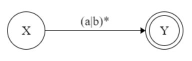

# RE&FA
_王贤义 计算机基地班 320210931221_
**利用RE与FA的等价关系证明： Σ={a,b}上， (a|b)* 与 ( a* | b* )* 等价。**

## (a|b)*

### 构造初始化

### 构造NFA

### 确定化

| $I$ |  $I_a$  | $I_b$ |
| :--: | :--: | :--: |
| {X,1,Y} | {1,Y} | {1,Y} |
| {1,Y} | {1,Y} | {1,Y} |

### 重新编号的状态矩阵

|  S   |  a   |  b   |
| :--: | :--: | :--: |
|  0   |  1   |  1   |
|  1   |  1   |  1   |

### 转成DFA

### 最简DFA

## (a\*|b\*)\*

### 构造初始化

### 构造NFA

### 确定化

|     $I$     |   $I_a$   |   $I_b$   |
| :---------: | :-------: | :-------: |
| {X,1,2,3,Y} | {1,2,3,Y} | {1,2,3,Y} |
|  {1,2,3,Y}  | {1,2,3,Y} | {1,2,3,Y} |

### 重新编号的状态矩阵

|  S   |  a   |  b   |
| :--: | :--: | :--: |
|  0   |  1   |  1   |
|  1   |  1   |  1   |

### 转成DFA

### 最简DFA

## 故得证